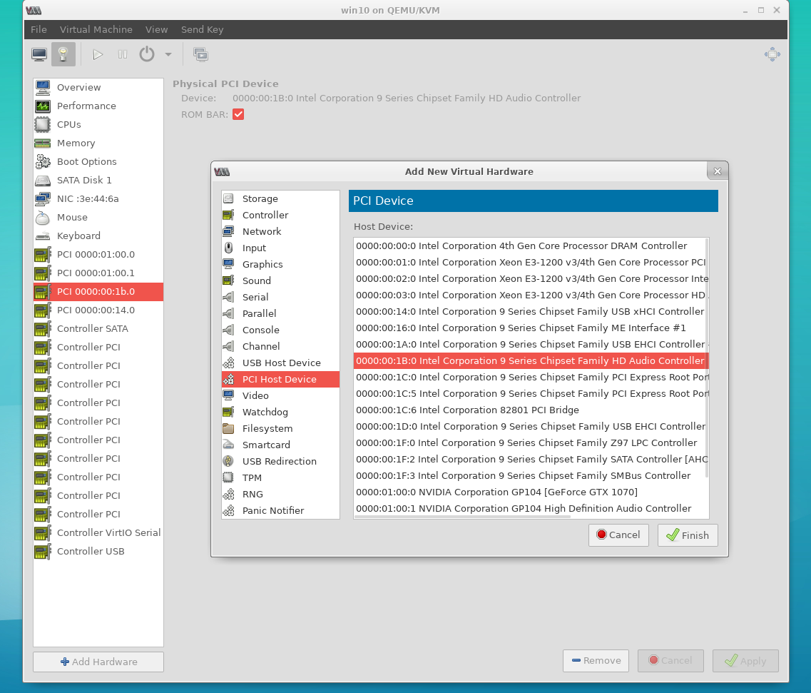

# KVM GPU passthrough guide in Polish

I am writing this guide mostly for my own usage.
If you are looking for english version please contact me.
I will do my best to provide it.

## 0 Cel

Preferujesz prace z systemem Linuks i lubisz grać w gry? Istenieje wiele rozwiązań tego typu:

* dual boot,
* dwa komputery z dwoma systemami (Linux i Windows),
* komputer i konstola do gier,
* wine,
* itd.

Istnieje jednak opcja o której niewiele osób wie, a mianowicie wirtualizacja windowsa i przekazanie mu kontroli nad podzespołami, tak aby na wirtulaizacji tracić jak najmniej. Można to uzyskać za pomocą KVM czyli Kernel Virtual Machines. Niniejszy poradnik wyjaśnia jak to zrobić krok po kroku.

## 1 Wymagania sprzętowe i uruchomienie niezbędnych funkcji

* Płyta główna i procesor musi musi wspierać technologię IOMMU (Wiekszość nowych procesorów i płyt posiada tą funkcje)
* W biosie należy uruchomić wsparcie dla wyżej wymienionej techologii poprzez uruchomienie AMD-Vi/Intel VT-d (w zależności od dostawcy sprzętu)

    W przypadku tandemu i5 4690k + MSI z97 PC MATE wygląda to jak na poniższym obrazku
    

* Minimum 10GB pamieci RAM aby sprostać wymaganiom nowczesnych gier, dla starszych wystarczy mniej
* Dwie karty graficzne, zintegorwana intela + nvidia, nvidia + amd, intel + amd (Można użyć dwóch kart tego samego producenta np amd + amd, jednak może być to kłopotliwe)
* Najlepiej dwa monitory, polecam takze urządzenia typu KVM switch.

## 2 Instalacja systemu operacyjnego

* Instaluj Arch Linux zgodnie z moim poradnikiem: [link](https://github.com/piogrzej/arch_install_guide_pl)
> NOTE: Oczywiście można użyć dowolnego systemu operacyjnego Linuks o ile kernel wspiera odpowiednie funkcje
* Wykonaj punkty od 1 do 14 włącznie
* W punkcie 14 do parametrów wywołania EFI należy dodać wpis uruchamiający IOMMU:

    efibootmgr -d /dev/sdX -p Y -c -L "Arch Linux" -l /vmlinuz-linux -u "root=/dev/sdb4 rw initrd=/initramfs-linux.img intel_iommu=on"

* W punkcie 15 instalowane są sterowniki karty graficznej. Nie ma potrzeby instalowania sterowników karty graficznej przekazywanej do maszyny wirtualnej. Wystarczy że system rozpoznaje urządzenie PCIE, w moim przypadku wystarczyło zainstalować sterowniki MESA do obsługi zintegrowanego GPU. Gdy już wykonane zostaną te operacje wstrzymaj sie z dalszym instalowaniem systemu. Wykonuj kolejne punkty niniejszego poradnika do momentu aż nie zostanie zaznaczone, że możesz dokończyć instalację systemu.

## 3 Sprawdzenie czy IOMMU jest uruchomine

Wykonaj polecenie:

    dmesg|grep -e DMAR -e IOMMU

Wynik powinien byc podobny do poniższego:

    [    0.000000] ACPI: DMAR 0x00000000BDCB1CB0 0000B8 (v01 INTEL  BDW      00000001 INTL 00000001)
    [    0.000000] Intel-IOMMU: enabled
    [    0.028879] dmar: IOMMU 0: reg_base_addr fed90000 ver 1:0 cap c0000020660462 ecap f0101a
    [    0.028883] dmar: IOMMU 1: reg_base_addr fed91000 ver 1:0 cap d2008c20660462 ecap f010da
    [    0.028950] IOAPIC id 8 under DRHD base  0xfed91000 IOMMU 1
    [    0.536212] DMAR: No ATSR found
    [    0.536229] IOMMU 0 0xfed90000: using Queued invalidation
    [    0.536230] IOMMU 1 0xfed91000: using Queued invalidation
    [    0.536231] IOMMU: Setting RMRR:
    [    0.536241] IOMMU: Setting identity map for device 0000:00:02.0 [0xbf000000 - 0xcf1fffff]
    [    0.537490] IOMMU: Setting identity map for device 0000:00:14.0 [0xbdea8000 - 0xbdeb6fff]
    [    0.537512] IOMMU: Setting identity map for device 0000:00:1a.0 [0xbdea8000 - 0xbdeb6fff]
    [    0.537530] IOMMU: Setting identity map for device 0000:00:1d.0 [0xbdea8000 - 0xbdeb6fff]
    [    0.537543] IOMMU: Prepare 0-16MiB unity mapping for LPC
    [    0.537549] IOMMU: Setting identity map for device 0000:00:1f.0 [0x0 - 0xffffff]
    [    2.182790] [drm] DMAR active, disabling use of stolen memory

Jeżeli nie widać wpisu `Intel-IOMMU: enabled` lub analogicznego, oznacza to że IOMMU nie jest uruchomione.

## 4 Upewnienie się że grupy IOMMU są poprawne

Aby upewnienić się ze grupy IOMMU są poprawne można wykonać skrypt:

    #!/bin/bash
    shopt -s nullglob
    for d in /sys/kernel/iommu_groups/*/devices/*; do
        n=${d#*/iommu_groups/*}; n=${n%%/*}
        printf 'IOMMU Group %s ' "$n"
        lspci -nns "${d##*/}"
    done;

W grupie karty graficznej powinny znajdowac sie tylko i wylacznie dwa urzadzenia, kontroler dzwieku HDMI oraz sama karta. Jedyny wyjatekim od tej zasady sa karty wieloprocesorowe np GTX 690.
> NOTE: Z mojego doświadczenia wynika jednak, że tego typu układy są ciężkie w przekazywaniu do VMa.

Jeżeli jednak wpis wygladą tak:

    IOMMU Group 1 00:01.0 PCI bridge [0604]: Intel Corporation Xeon E3-1200 v3/4th Gen Core Processor PCI Express x16 Controller [8086:0c01] (rev 06)
    IOMMU Group 1 01:00.0 VGA compatible controller [0300]: NVIDIA Corporation GM206 [GeForce GTX 960] [10de:1401] (rev a1)
    IOMMU Group 1 01:00.1 Audio device [0403]: NVIDIA Corporation Device [10de:0fba] (rev a1)

to grupowanie jest niepoprawne. Mostek PCI należy także do grupy karty graficznej. Jest to błąd. Niestety, nie każda płyta główna obsługuje grupowanie poprawnie. Z mojego doświadczenia wynika, że w takiej sytuacji rozwiązania są dwa. Po pierwsze, można pozostawić ten błąd "samemu sobie" i miec nadzieje że wersje pakietów używanych do wirtualizacji poradza sobie z nim. Tak właśnie jest w przypadku mojego prywatego komputera PC. Jest to jednak loteria na zasadzie "może zadziałać ale a nie musi". Ponadto, innym rozwiazaniem tego problemu jest przepięcie karty GPU do innego slotu PCI płyty głównej.

## 5 Wyizolowanie karty graficznej

W tym celu można użyć `vfio-pci`.
Wskazanie które urządzenia mają być wyizolowane poprzez edycje pliku:

    sudo nano /etc/modprobe.d/vfio.conf

Jego zawartość powinna wyglądać następująco:

    options vfio-pci ids=10de:1401,10de:0fba

gdzie ids to id urzadzeń GPU i kontrolera audio HDMI ktore można odczytać po wykonaniu polecenia:

    lspci -nn

> NOTE: id powinny być podobne do tych w powyższym przykładzie

aby upewnić się że kernel załaduje mod `vfio-pci` należy zatroszyczć się o odpowiednią konfiguracje.
Należy zedytować plik:

    sudo nano /etc/mkinitcpio.conf

Wpisy analogiczne do:

    MODULES=(... vfio vfio_iommu_type1 vfio_pci vfio_virqfd ...)

oraz

    HOOKS=(... modconf ...)

zedytować tak aby były zgodne z powższymi schematami.

Po wykonaniu powyższych kroków trzeba zregenerować kernel:

    sudo mkinitcpio -p linux

Ostatnim krokiem jest restart systemu, w ten sposób Linux wczyta zmiany.

## 6 Sprawdzenie poprawności wyizolowania

Należy wydać polecenie:

    lspci -nnk

Wynik powinien wygladać podobnie do poniższego:

    ...
    01:00.0 VGA compatible controller [0300]: NVIDIA Corporation GM206 [GeForce GTX 960] [10de:1401] (rev a1)
	    Subsystem: Micro-Star International Co., Ltd. [MSI] Device [1462:3201]
	    Kernel driver in use: vfio-pci
	    Kernel modules: nouveau, nvidia_drm, nvidia
    01:00.1 Audio device [0403]: NVIDIA Corporation Device [10de:0fba] (rev a1)
	    Subsystem: Micro-Star International Co., Ltd. [MSI] Device [1462:3201]
	    Kernel driver in use: snd_hda_intel
	    Kernel modules: snd_hda_intel
    ...

Jezeli widać wpis `Kernel driver in use: vfio-pci` to wyizolowanie powiodło sie.

## 7 Dokończenie instalowania systemu operacyjnego

Jeżeli wszytskie poprzednie kroki zakończy się skucesem można dokończyć instalacje systemu [link](https://github.com/piogrzej/arch_install_guide_pl)

## 8 Instalacja niezbędnych narzędzi

Należy zainstalować pakiety:

    sudo pacman -S qemu libvirt ovmf virt-manager

Warto tutaj zwrócić uwage na pakiet `ovmf`. Z jego pomocą wirtualizowane systemy umogą używać UEFI. Tak właściwie jest to klucz do sukcesu całej operacji przekazywania portów PCI.

## 9 Konfiguracja libvirt

Zedytować plik:

    sudo nano /etc/libvirt/qemu.conf

tak aby zawierał wpis:

    nvram = [
	    "/usr/share/ovmf/ovmf_code_x64.bin:/usr/share/ovmf/ovmf_vars_x64.bin"
    ]

Uruchomienie libvirt:

    sudo systemctl enable --now libvirtd
    sudo systemctl enable virtlogd.socket

## 10 Przygotowanie partycji dla maszyny wirtualnej

W celu zwiększenia wydajności systemu goscia należy stworzyć dla niego partycje na dysku zamiast instalować go standardowo do pliku.

W tym celu można użyć dowolnego narzędzia do tworzenia partycji, np gparted.

Należy utworzyć nową partycje. Jako typ systemu plików wybrać cleared (w przypadku gparted).

> NOTE: Jeżeli ma to być system do gier proponuję rozmiar partcji minimum 200GB.

## 11 Instalowanie systemu gościa

> NOTE: na screenach instalowany jest Linux, jednak dla Windowsa procedura jest identyczna

Uruchomić virt-manager poleceniem:

    virt-manager

Wybrać:

    File -> New Virtual Machine

Wybrać rodzaj medium instlacyjnego (w tym przypadku ISO).

W kolejnym kroku podać scieżkę do pliku, odznaczyć `Automatically detect operating system based on install media`, ustawić odpowiedni `OS type` i `Version`

Podać rozmiar pamieci ram przypisanej do maszyny. W mojej opini minimum 8GB. Liczbę procesorów można narazie pominąć.

W następnym oknie dialogowym pada pytanie o rodzaj obrazu dysku. Narazie nie należy go tworzyć. Z tego powodu należy odznaczyć `Enable storage for this virtual machine` i przejść dalej.

W finalnym oknie dialogowym wybrać `Customize configuration before install` oraz typ sieci według własnego uznania.
Kliknąć `Finish`.

Otowrzy sie okno konfiguracyjne.

W zakladce Overview należy zmienić firmware na `UEFI`, a chipset na `Q35`.

Usunać Ide Disk 1, jeżeli takowy istnieje.

W zakladce `CPUs` należy ustawić topologię procesora.

W model wpisać (na liście rozwijanej może nie być dostępne) `host-passthrough`.

Rozwinać zakładkę `topology` i dostosować ją `Manually set CPU topology`.

Należy wispać liczbę socketów, rdzeni i watków per rdzeń.

Ustawić `Current allocation` na minimum 4 rdzenie.

> NOTE: Z mojego doświadczenia wynika że najlepiej jest przekazać wszytskie rdzenie/wątki procesora.

Kilknąć przycisk `Add Hardware`.

Dodać nowy `Storage`. Ważne jest aby zanzaczyć `Select or create custom device` i *WPISAĆ* sciezke do wcześniej utworzonej partycji, np `/dev/sdb1`.

> NOTE: można także użyć UUID

Wybrać Bus Type SATA i `cache mode` `none`. Kilknąć `Finish`.

Analogicznie jak dysk należy dodać obydwa urzadzenia karty graficznej (odpowiedzialne za audio i video) `PCI Host Device`

Kliknąć `Begin Installation`. Instalować system narazie w trybie zemulowanej grafiki. Po zainstalowaniu systemu zainstalować sterowniki graifki docelowej.

Zrestartować system gościa.

W przypadku grafiki Nvidi najprawdopodbniej po restarcie sterownik bedzie raportował błąd: `Error 43: Driver failed to load`.

Aby usunać ten błąd należy wyłączyć maszynę a następnie zedytować jej ustawienia. Wydać polecenie:

    sudo EDITOR=nano virsh edit [nazwamaszyny]

Zedytować plik tak aby był zgodny z schematem:

    ...
    <features>
	    <hyperv>
		    ...
		    <vendor_id state='on' value='whatever'/>
		    ...
	    </hyperv>
	    ...
	    <kvm>
	    <hidden state='on'/>
	    </kvm>
    </features>
    ...

Otworzyć ponownie konfiguracje maszymy. W tym celu w virt-manager zaznaczyć maszynę i klikąć Open.
Nastepnie wybrać przycisk `Show virtual hardware detalis`. Należy usunąć wszytskie zbędne elementy takie jak emulowane ekrany, konsole, metody input itd.
Za pomoca Add hardware dodać `USB Host Device` czyli myszkę i klawiature.

Z mojego doświadczenia wynika, że przekazwyanie `USB Host device` może powodować problemy, szczególnie w przypadku daców/krat dźwiękowych USB. Rozwiązaniem tego problemu jest przekazanie całego kontrolera USB za pomocą przekazania urządzenia `PCI Host Device`. W tym przypadku w przeciweństwie do karty graficznej nie trzeba izlować urządzenia PCI. Niestety nie wszytskie płyty główne umożliwają wykonanie takiej operacji. Ponadto w przypadku kontrolera USB możliwe że będzię potrzebny eksperyment na zasadzie "prób i błędów" w celu wybrania poprawnego urządzenia z listy.

Uruchamć ponownie system. Teraz obraz pownien być już wyświetlany na monitorze podpiętym do karty graficznej.

## 12 Audio na maszynie wirtualnej.

W celu uruchomienia dźwięku na wierualnej maszynie można wykorzystać kilka metod, między innymi:

* Przekazywanie audio przez pulse audio,
* Dźwięk po hdmi.

Z mojego doświadczenia jednak wynika że nie są to metody idealne. Dźwięk może być przerywany, spowolniony lub zanieczyszczony. W oby tych metodach nie działa mikrofon.

Idealnym rozwiązaniem jest przekazanie zintegrowanej kraty dźwiękowej, proces jest anlogiczny jak w przypadku dodawania kontrolera USB.

# 13 Wykrywanie partycji guesta na host

Domyślnie pliki znajdujące się na pratycji guesta nie są widoczne z poziomu hosta.

Aby rozwiązać ten problem należy zainstalować:

    yaourt multipath-tools

W celu wykrycia partycji wydać polecenie:

    sudo kpartx -a <scizeka do partycji np. /dev/sdb2>

# Bibliografia

Poradnik w dużej mierze oparty na wpisie z [ArchWiki](https://wiki.archlinux.org/index.php/PCI_passthrough_via_OVMF)

Specjane podziękowania dla Żwirka ;-) za pomoc w dobraniu najlepszych ustawień cache dla dysków oraz wspomnieniu o narzędziu kpartx.
