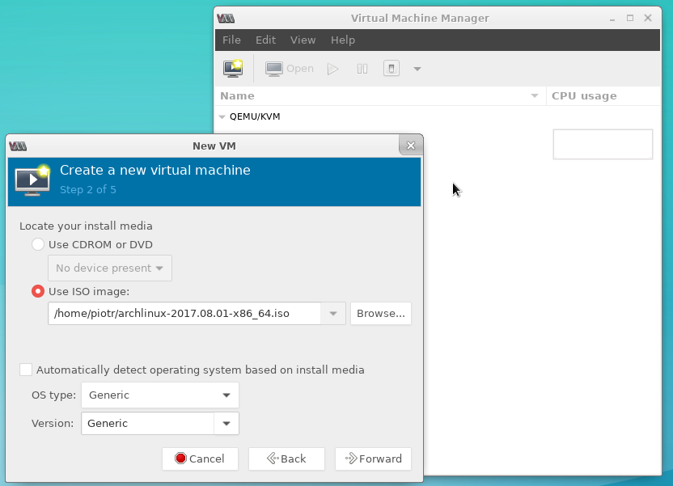
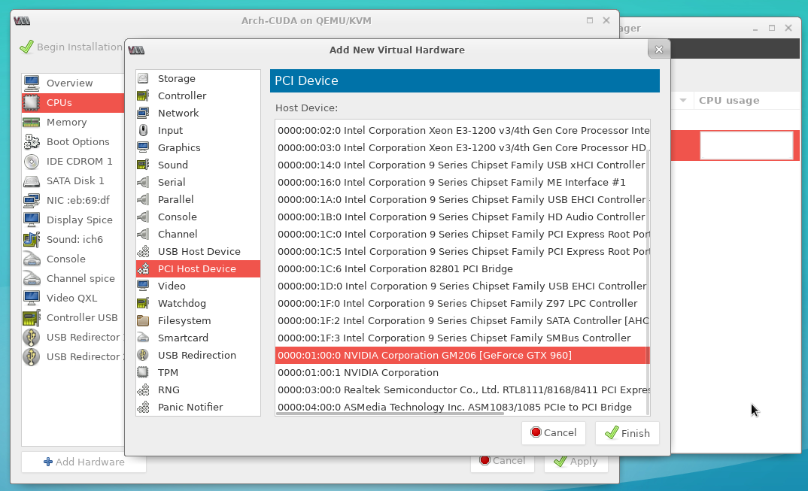

# KVM GPU passthrough guide in Polish

I am writing this guide mostly for my own usage.
If you are looking for english version please contact me.
I will do my best to provide it.

## 0 Cel

Lubisz pracowac na Linuksie i grac w gry? Sporo osob uwaza ze istnieja dwa rozwiazania:

* System operacyjny Windows i maszyna wirtulana Linux
* Dual Boot

Istnieje jednak trzecia opcja, a mianowicie wirtualizacja windowsa i przekazanie mu kontroli nad podzespolami,
 tak aby na wirtulaizacji tracic jak najmniej. Mozna to uzyskac za pomoca KVM czyli Kernel Virtual Machines.

## 1 Wymagania sprzetowe i uruchomienie niezbednych funkcji

* Twoja plyta glowna i procesor musi musi wspierac technologie IOMMU (Wiekszosc nowych procesorow i plyt posiada ta funkcje)
* W biosie musisz uruchomic wsparcie dla wyzej wymienionej techologi poprzez uruchomienie AMD-Vi/Intel VT-d (w zaleznosci od dostawcy sprzetu)
* Minimum 10GB pamieci RAM aby sprostac wymaganiom nowczesnych gier, dla starszych wystarczy mniej
* Dwie karty graficzne, zintegorwana intela + nvidia, nvidia + amd, intel + amd (Mozna uzyc dwoch kart tego samego producenta np amd + amd, jednak jest to klopotliwe)
* Najlepiej dwa monitory, polecam takze urzadzenia typu KVM swich.

## 2 Instalacja systemu operacyjnego

* Instaluj Arch Linux zgodnie z moim poradnikiem: [link](https://github.com/piogrzej/arch_install_guide_pl)
* Wykonaj punkty od 1 do 14 wlacznie
* W punkcie 15 instaluje sie sterowniki karty graficznej. Jako ze masz dwie karty graficzne bedziesz instalowal dwa sterowniki grafiki
np mesa + nvidia. Gdy juz wykonasz te operacje wstrzymaj sie z dalszym instalowaniem systemu. Wykonuj kolejne punkty niniejszego poradnika
do momentu az nie zaznacze ze mozesz dokonczyc instalacje systemu.

## 3 Sprawdzenie czy IOMMU jest napewno uruchomine

Wykonaj polecenie:

    dmesg|grep -e DMAR -e IOMMU

Wynik powinien byc podobny do ponizszego:

    [    0.000000] ACPI: DMAR 0x00000000BDCB1CB0 0000B8 (v01 INTEL  BDW      00000001 INTL 00000001)
    [    0.000000] Intel-IOMMU: enabled
    [    0.028879] dmar: IOMMU 0: reg_base_addr fed90000 ver 1:0 cap c0000020660462 ecap f0101a
    [    0.028883] dmar: IOMMU 1: reg_base_addr fed91000 ver 1:0 cap d2008c20660462 ecap f010da
    [    0.028950] IOAPIC id 8 under DRHD base  0xfed91000 IOMMU 1
    [    0.536212] DMAR: No ATSR found
    [    0.536229] IOMMU 0 0xfed90000: using Queued invalidation
    [    0.536230] IOMMU 1 0xfed91000: using Queued invalidation
    [    0.536231] IOMMU: Setting RMRR:
    [    0.536241] IOMMU: Setting identity map for device 0000:00:02.0 [0xbf000000 - 0xcf1fffff]
    [    0.537490] IOMMU: Setting identity map for device 0000:00:14.0 [0xbdea8000 - 0xbdeb6fff]
    [    0.537512] IOMMU: Setting identity map for device 0000:00:1a.0 [0xbdea8000 - 0xbdeb6fff]
    [    0.537530] IOMMU: Setting identity map for device 0000:00:1d.0 [0xbdea8000 - 0xbdeb6fff]
    [    0.537543] IOMMU: Prepare 0-16MiB unity mapping for LPC
    [    0.537549] IOMMU: Setting identity map for device 0000:00:1f.0 [0x0 - 0xffffff]
    [    2.182790] [drm] DMAR active, disabling use of stolen memory

Jezeli nie widzimy wpisu "Intel-IOMMU: enabled" lub analogicznego, to oznacza ze IOMMU nie jest uruchomione.

## 4 Upewnienie sie ze grupy IOMMU sa poprawne

Wykonaj polecenie:

    lspci -nn

Wynik miedzy innymi powinien zawierac wpisy podobne do tego:

    01:00.0 VGA compatible controller [0300]: NVIDIA Corporation GM206 [GeForce GTX 960] [10de:1401] (rev a1)
    01:00.1 Audio device [0403]: NVIDIA Corporation Device [10de:0fba] (rev a1)

Jezeli jednak wpis wyglada tak:

    00:01.0 PCI bridge: Intel Corporation Xeon E3-1200 v2/3rd Gen Core processor PCI Express Root Port (rev 09)
    01:00.0 VGA compatible controller: NVIDIA Corporation GM107 [GeForce GTX 750] (rev a2)
    01:00.1 Audio device: NVIDIA Corporation Device 0fbc (rev a1)

to grupowanie jest niepoprawne. Port procesora tez nalezy do tej samej grupy co karta graficzna.
W takiej sytacji do maszyny wirtualnej bedziesz musial przekazac takze to dodatkowe uzadzenie. Jezeli wolisz tego uniknac
mozesz tez sprobowac wsadzic karte graficzna do innego protu pci-e.

## 5 Wyizolowanie karty graficznej

W tym celu bedziemy uzywali vfio-pci.
Wskazanie ktore urzadzenia maja byc wyizolowane poprzez edycje pliku:

    sudo nano /etc/modprobe.d/vfio.conf

Jego zawartosc powinna wygladac nastepujaco:

    options vfio-pci ids=10de:1401,10de:0fba

gdzie ids to id urzadn ktore mozna odczytac po wykonaniu polecenia (powinny byc podobne do tych w  powyzszym przykladzie):

    lspci -nn

aby upewnic sie ze kernel zaladuje mod vfio-pci musimy zatroszyczc sie o odpowiednia konfiguracje.
Edytujemy plik:

    sudo nano /etc/modprobe.d/vfio.conf

Znajdujemy wpisy analogiczne do:

    MODULES="... vfio vfio_iommu_type1 vfio_pci vfio_virqfd ..."

oraz

    HOOKS="... modconf ..."

edytujemy je tak aby byly zgodne z powzyszymi schematami.
Regenerujemy kernel:

    sudo mkinitcpio -p linux

Restartujemy system.

## 6 Sprawdzamy poprawnosc wyizolowania

Wydajemy polecenie:

    lspci -nnk

Wynik powinien wygladac podobnie do:

    ...
    01:00.0 VGA compatible controller [0300]: NVIDIA Corporation GM206 [GeForce GTX 960] [10de:1401] (rev a1)
	    Subsystem: Micro-Star International Co., Ltd. [MSI] Device [1462:3201]
	    Kernel driver in use: vfio-pci
	    Kernel modules: nouveau, nvidia_drm, nvidia
    01:00.1 Audio device [0403]: NVIDIA Corporation Device [10de:0fba] (rev a1)
	    Subsystem: Micro-Star International Co., Ltd. [MSI] Device [1462:3201]
	    Kernel driver in use: snd_hda_intel
	    Kernel modules: snd_hda_intel
    ...

Jezeli widzimy wpis "Kernel driver in use: vfio-pci" to wyizolowanie udalo sie.

## 7 Dokoncz instalowanie systemu operacyjnego

Dokoncz instalacje systemu operacyjnego zgodnie z moim poradnikiem: [link](https://github.com/piogrzej/arch_install_guide_pl)

## 8 Instalacja niezbednych narzedzi

Zainstaluj pakiety:

    sudo pacman -S qemu libvirt ovmf virt-manager

Warto tutaj zwrocic uwage na pakiet ovmf. Z jego pomoca wirtualizowane systemy umoga uzywac UEFI. Tak wlasciwie jest to klucz do sukcesu calej operacji przkeazywania portow pci-e.

## 9 Konfiguracja libvirt

Edytujemy plik:

    sudo nano /etc/libvirt/qemu.conf

tak aby zawieral wpis:

    nvram = [
	    "/usr/share/ovmf/ovmf_code_x64.bin:/usr/share/ovmf/ovmf_vars_x64.bin"
    ]

Uruchamiamy libvirt:

    sudo systemctl enable --now libvirtd
    sudo systemctl enable virtlogd.socket

## 10 Przygotowanie partycji dla maszyny wirtualnej

W celu zwiekszenia wydajnosci systemu goscia nalezy stworzyc dla niego partycje na dysku zamiast instalowac system standardowo do pliku.

W tym celu uruchamiamy nasze ulubione narzedzie do tworzenia partycji, np gparted.

Tworzymy nowa partycje. Jako typ systemu plikow wybieramy cleared (w przypadku gparted).

Jezeli ma to byc system do gier proponuje rozmiar partcji minimum 200GB.

## 11 Instalowanie systemu goscia

### UWAGA na screenach instaluje Linuxa jednak dla Windowsa procedura jest identyczna

Uruchamiany virt-manager poleceniem:

    virt-manager

Wybieramy:

    File -> New Virtual Machine

Wybieramy rodzaj medium instlacyjnego (w moim przypadku ISO).

W kolejnym kroku podajemy sciezke do pliku, odzanaczmy "Automatically detect operating system based on install media"
i ustawiamy odpowiedni OS type i Version

Ustawiamy rozmiar pamieci ram przypisanej do maszyny. W mojej opini minimum 8GB. Liczbe procesorow narazie pomijamy.

W nastepnym oknie dialogowym jestemy pytani o rodzaj obrazu dysku. Narazie nie chcemy go tworzyc. Odznaczamy wiec "Enable storage for this virtual machine" i przechodzimy dalej.

W finalnym oknie dialogowym zanaczamy "Customize configuration before install" oraz wybieramy typ sieci nam odpowiadjacy.
Klikamy "Finish".

Otowrzy sie okno konfiguracyjne.

W zakladce Overview zmieniamy firmware na UEFI, a chipset na Q35.

Usuwamy Ide Disk 1, jezeli takowy istnieje.

W zakladce CPUs konfigurujemy topologie procesora.

W model wpisujemy (na liscie rozwijanej moze nie byc dostepne) "host-passthrough"

Rozwiajamy topology i dostosowywujemy ja "Manually set CPU topology".

Wpisujemy liczbe socketow, rdzeni i watkow per rdzen.

Ustawiamy "Current allocation" na minimum 4 rdzenie.

Kilkamy przycisk Add Hardware.

Dodajemy nowy "Storage". Znaznaczmy "Select or create custom device" i *WPISUJEMY* sciezke do naszej partycji, np /dev/sdb1.
Wybieramy Bus Type SATA i chace mode none. Kilkamy Finish.

Analogicznie jak dysk dodajemy obydwa urzadzenia karty graficznej (odpowiedzialne za audio i video) "PCI Host Device"

Klikamy Begin Installation. Instalujemy system narazie w trybie zemulowanej grafiki. Po zainstalowaniu systemu instalujemy sterowniki graifki wlasciwiej.

Restartujemy system goscia.

W przypadku grafiki Nvidi najprawdopodbniej po restarcie sterownik bedzie raportowal blad: "Error 43: Driver failed to load".

Wylaczamy maszyne.

Aby usunac ten blad nalezy zedytowac ustawienia maszyny. Wydajemy polecenie:

    sudo EDITOR=nano virsh edit [nazwamaszyny]

Edytujemy plik tak aby byl zgodny z schematem:

    ...
    <features>
	    <hyperv>
		    ...
		    <vendor_id state='on' value='whatever'/>
		    ...
	    </hyperv>
	    ...
	    <kvm>
	    <hidden state='on'/>
	    </kvm>
    </features>
    ...

Otwieramy ponownie konfiguracje maszymy. Zaznaczamy maszyny i klikamy Open.
Nastepnie kilkamy przycisk "Show virtual hardware detalis". Usuwamy zbedne elementy takie jak emulowane ekrany, konsole, metody input itd.
Za pomoca Add hardware dodajemy USB Host Device czyli myszke i klawiature.

Uruchamiamy ponownie system. Teraz system bedzie juz wyswietlany na monitorze podpietym do karty graficznej.

## 12 przekazywanie audio przez pulse audio.

Zedytuj pilk:

    sudo nano /etc/libvirt/qemu.conf

odkomentuj linie:

    #user = ""

wpisz swoja nazwe uzytkownika:

    user = "piotr"

zapisz plik. Zedytuj kolejny plik:

    sudo EDITOR=nano virsh edit [nazwamaszyny]

zastap:

    <domain type='kvm'>

na:

    <domain type='kvm' xmlns:qemu='http://libvirt.org/schemas/domain/qemu/1.0'>

oraz:

     </devices>
    </domain>

na:

       </devices>
          <qemu:commandline>
            <qemu:env name='QEMU_AUDIO_DRV' value='pa'/>
            <qemu:env name='QEMU_PA_SERVER' value='/run/user/1000/pulse/native'/>
          </qemu:commandline>
     </domain>

W wpisie '/run/user/1000/pulse/native' zamien 1000 na id swojego uzytkownika. Id mozesz sprawdzic za pomoca polecenia:

    id

Zrestartuj usugi (*jako Twoj uzytkownik!*):

    systemctl restart libvirtd
    pulseaudio --kill
    pulseaudio --start

W samym windowsie nie zapomnij o wybraniu odpowiedniego urzadzenia audio.
W przypadku systemow windows mozesz takze doswiadczyc trzeszczenia jak w starych plytach gramofonowych.
Nie przejmuj sie jest to normalane.

# 13 Wykrywanie partycji guesta na host

Nalezy zainstalowac:

    yaourt multipath-tools
    
W celu wykrycia partycji wydajemy polecenie:

    sudo kpartx -a <scizeka do partycji np. /dev/sdb2>

# Bibliografia

Poradnik w duzej mierze oparty na wpisie na [archWiki](https://wiki.archlinux.org/index.php/PCI_passthrough_via_OVMF)

Specjane podziekowania dla Zwirka ;-) za pomoc w dobraniu najlepszych ustawien cache dla dyskow oraz wspomnieniu o narzedziu kpartx.
